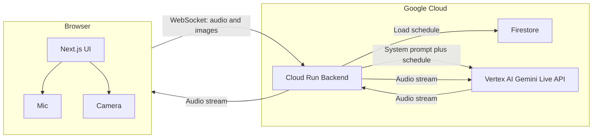

# MedMate architecture

High-level flow: the browser talks to the MedMate backend on Cloud Run; the backend loads the elder's schedule from Firestore, injects it into the system prompt, and proxies audio and images to the Vertex AI Gemini Live API. Audio (and optional transcript) is streamed back to the client.

## Components

| Component | Role |
|-----------|------|
| **Browser (Next.js)** | Captures microphone (16 kHz PCM) and optional camera snapshot ("Show pill"). Sends audio and images over WebSocket to the backend. Plays back audio from the model (24 kHz PCM). |
| **Cloud Run (backend)** | Accepts WebSocket with `elder_id`. Loads that elder's schedule from Firestore, builds MedMate system instruction, and opens a session to Vertex AI Live API. Proxies messages between client and Vertex. |
| **Firestore** | Stores per-elder medication schedules: `elders/{id}` with `schedule: { morning, afternoon, night }`. |
| **Vertex AI Gemini Live API** | Multimodal live model: voice in/out, images in the same session, barge-in. Returns audio (and optional transcript) to the backend, which forwards it to the client. |

## Session flow

1. User selects elder (e.g. "Demo Elder") and clicks **Start session**.
2. Frontend opens WebSocket to backend: `ws://backend/ws?elder_id=elder-demo`.
3. Backend loads schedule from Firestore, builds system prompt, connects to Vertex Live API, and sends setup (model, system instruction, AUDIO response).
4. After Vertex sends `setupComplete`, backend is ready; client can send audio and images.
5. User clicks **Start microphone**; frontend streams base64 PCM to backend; backend forwards as `realtime_input` to Vertex.
6. User can click **Show pill or bottle**; frontend captures one camera frame, sends as `realtime_input` (image/jpeg); backend forwards to Vertex.
7. Vertex responds with audio (and optional transcript); backend forwards to client; client plays audio. User can interrupt (barge-in) by speaking again.
