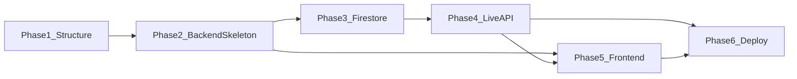

# MedMate — Phase-Wise Implementation Plan

Repo currently has only docs ([PLAN.md](PLAN.md), [TECH_STACK.md](TECH_STACK.md), [README.md](README.md), etc.); no `frontend/`, `backend/`, `docs/`, or `scripts/` yet. Execute phases in order; complete "What you do" steps before or right after each phase's build.

---

## Phase 1: Foundation and repo structure

**Goal:** Create directory layout and minimal runnable apps so the structure is real and testable.

**Build tasks:**

- Create directories: `frontend/`, `backend/`, `docs/`, `scripts/`.
- Add root `[.gitignore](.gitignore)`: `node_modules/`, `__pycache__/`, `.env`, `.env.local`, `*.pyc`, `backend/service-account.json`, `.next/`, `dist/`, IDE and OS cruft.
- **Frontend placeholder:** Scaffold Next.js (TypeScript) in `frontend/` with `create-next-app` (App Router, Tailwind, no placeholder content). Ensure `npm run dev` serves a single page (e.g. "MedMate" title only).
- **Backend placeholder:** In `backend/`, add a minimal Python app (e.g. FastAPI with one GET `/health` returning `{"status":"ok"}`) and a `requirements.txt` (e.g. `fastapi`, `uvicorn`). Ensure `uvicorn main:app` (or equivalent) runs. Alternatively use Node/Express with one GET `/health` and `package.json`.
- Optionally add a one-line note in [README.md](README.md) under "Setup" that frontend and backend run via `frontend/` and `backend/` (exact commands added in later phases).

**What you do:** Google account, create GCP project (e.g. `medmate-hackathon`), attach billing (or free trial / hackathon credits), optionally install and auth `gcloud` and set default project. See [PLAN.md](PLAN.md) Phase 1 checkboxes.

---

## Phase 2: GCP APIs and backend skeleton

**Goal:** Backend that can be containerized and deployed to Cloud Run, with env placeholders for GCP.

**Build tasks:**

- **HTTP + WebSocket skeleton:** In `backend/`, add an HTTP server (FastAPI or Express) with:
  - GET `/health` or `/ready` for Cloud Run (return 200 + simple JSON).
  - Placeholder route for the future Live session (e.g. POST `/session` or WebSocket `/ws` that returns "not implemented" or accepts connection and echoes nothing for now).
- **Environment:** Read `GOOGLE_CLOUD_PROJECT` and `GOOGLE_APPLICATION_CREDENTIALS` (optional for local) from env; log or expose in health only that project is set (do not log credentials). Document in README or `backend/README.md`.
- **Docker:** Add [backend/Dockerfile](backend/Dockerfile): multi-stage if desired; install deps, copy app, expose port (e.g. 8080), run the app. Ensure `docker build` and `docker run` work locally.
- **Deploy script:** Add [scripts/deploy.sh](scripts/deploy.sh) (or `deploy-backend.sh`) that: sets `gcloud` project, builds the backend image (e.g. with `gcloud builds submit` or local Docker + push to Artifact Registry), deploys to Cloud Run with `gcloud run deploy`, sets env var `GOOGLE_CLOUD_PROJECT`. Make script idempotent where possible and document in README.

**What you do:** Enable Vertex AI, Cloud Run, and Firestore APIs; create service account (e.g. `medmate-backend`) with Vertex AI User and Firestore roles; download JSON key to `backend/service-account.json` (already in `.gitignore`); set `GOOGLE_APPLICATION_CREDENTIALS` for local runs. See [PLAN.md](PLAN.md) Phase 2.

---

## Phase 3: Database (Firestore) for users and schedules

**Goal:** Firestore schema and backend code to read/write per-elder schedule; optional seed for demo.

**Build tasks:**

- **Schema (document in code or [docs/](docs/)):** Collection `elders`; document ID = elder ID. Fields: `schedule: { morning: [{ name, strength? }], afternoon: [...], night: [...] }`, optional `displayName`, `language`. Keep type definitions or examples in backend (e.g. Pydantic/TypeScript interface).
- **Backend — read:** Function or route to load one elder by ID from Firestore and return their schedule (e.g. GET `/elders/:id/schedule` or internal `get_elder_schedule(elder_id)` used later by session).
- **Backend — write:** Endpoint or script to create/update an elder's schedule (e.g. POST `/elders/:id/schedule` or PUT for admin/demo; or a script that uses Firestore SDK to write one document).
- **Seed (optional):** Script in `scripts/` (e.g. `seed-elder.js` or `seed_elder.py`) that writes one test elder with sample morning/afternoon/night meds (e.g. morning: Lisinopril 10 mg, Vitamin D; night: Metformin 500 mg, Aspirin 81 mg). Document how to run it.
- Add Firestore dependency: e.g. `google-cloud-firestore` (Python) or `@google-cloud/firestore` (Node). Use `GOOGLE_APPLICATION_CREDENTIALS` and `GOOGLE_CLOUD_PROJECT` for local; same for Cloud Run (no key file in prod).

**What you do:** Create Firestore DB (Native mode, region e.g. `us-central1`). Create one `elders` doc manually or via the seed script. Optionally set Firestore rules for demo. See [PLAN.md](PLAN.md) Phase 3.

---

## Phase 4: Backend — Vertex AI Live API integration

**Goal:** Backend opens a Live API session, injects MedMate system prompt + elder schedule, forwards audio and images, streams audio (and optional transcript) back.

**Build tasks:**

- **System prompt:** Define MedMate persona (calm, clear, patient, short sentences) and instructions: use the injected elder schedule for morning/afternoon/night; identify pill (imprint, shape, color) or bottle (label); if user shows a pill for another time, say what it is and what to take now. See [PLAN.md](PLAN.md) §3 must-haves (wrong-pill handling).
- **Load schedule and inject:** At session start, accept elder ID (query or body), load schedule from Firestore via Phase 3 code, and inject a text block (e.g. "This elder's schedule: Morning: ...; Afternoon: ...; Night: ...") into the system prompt.
- **Live API session:** Use Vertex AI Gemini Live API (WebSocket or SDK). Backend: (1) open session with system prompt, (2) forward client audio chunks to Vertex, (3) on "Show pill" receive image from client and send to Vertex as part of the same session, (4) stream audio (and optionally transcript) back to client. Handle barge-in per API design (typically server-side handling when client sends new audio).
- **Session endpoint:** Expose one session entry (e.g. WebSocket `/ws?elder_id=...` or POST that upgrades to stream). Client sends audio (and optionally images); server streams back audio. Keep health/readiness endpoint for Cloud Run.
- **Error handling:** Timeouts, invalid elder ID, Firestore/Vertex errors; return clear messages and disconnect gracefully.

**What you do:** Confirm Vertex AI and service account permissions; test backend locally with a test elder ID; deploy backend to Cloud Run and set `GOOGLE_CLOUD_PROJECT`. See [PLAN.md](PLAN.md) Phase 4.

---

## Phase 5: Frontend (voice + "Show pill" + prod-level UI)

**Goal:** Production-quality web app: voice in/out, "Show pill" camera capture, connection state, and elder-friendly UX per [PLAN.md](PLAN.md) §5b.

**Build tasks:**

- **Session and connection:** Page to start a session (elder ID: dropdown or hardcoded for demo). Connect to backend (WebSocket or streaming endpoint). Show connection state (Connecting / Connected / Error) with clear copy and recovery (e.g. "Couldn't connect — check your mic").
- **Voice:** Use Web Audio API to capture mic; send audio chunks to backend; receive and play back audio stream. Visual feedback when mic is active and when agent is speaking (e.g. "Listening…" / "Speaking…").
- **Show pill:** Prominent "Show pill" button; on tap, request camera (getUserMedia), capture one frame (e.g. JPEG), send to backend in the same session; show feedback (e.g. thumbnail or "Sent"). No need to support both pill and bottle in UI — either is enough per plan.
- **Design system:** Cohesive typography, spacing, colors; calm, trustworthy look (e.g. soft colors, clear hierarchy). No lorem or dev-only UI.
- **Accessibility and UX:** Large text and touch targets (min ~44px); clear labels for mic on/off, "Show pill", connection status; simple navigation; primary actions obvious. Aim for WCAG AA where feasible.
- **Responsive:** Layout works on phone/tablet first, then desktop.
- **States and polish:** Loading ("Connecting…", "Listening…"), clear errors with recovery, no major layout shift, smooth transitions. Set `NEXT_PUBLIC_BACKEND_URL` for local and production.

**What you do:** Configure `frontend/.env.local` (and prod env) with backend URL; run frontend; test locally with backend (voice + one "Show pill"); use HTTPS in production for mic/camera. See [PLAN.md](PLAN.md) Phase 5.

---

## Phase 6: Deploy, integration, and demo prep

**Goal:** Automated deployment for bonus, judge-ready README, and architecture diagram.

**Build tasks:**

- **Deploy automation:** Keep all automation in [scripts/](scripts/) (and optionally [infra/](infra/)). Ensure [scripts/deploy.sh](scripts/deploy.sh) (or `deploy-backend.sh` / `deploy-frontend.sh`) builds and deploys backend to Cloud Run; optionally add frontend deploy (e.g. Vercel CLI or Firebase Hosting). Idempotent where possible (project, APIs, deploy). Document in README: "Automated deployment: see [scripts/](scripts/) (or [infra/](infra/))."
- **README:** Spin-up for judges: (1) clone repo, (2) run backend locally (env vars, credentials, port), (3) run frontend locally (env var for backend URL), (4) optional: run deploy script(s) and link to scripts/ for bonus.
- **Architecture diagram:** Add to [docs/](docs/) (e.g. `architecture.md` with Mermaid or an image): Browser ↔ Cloud Run ↔ Vertex AI Live API; Cloud Run ↔ Firestore. Match [TECH_STACK.md](TECH_STACK.md) and [PLAN.md](PLAN.md) §6.

**What you do:** Deploy backend and frontend; record GCP proof (Cloud Run/Firestore/Vertex in console or code link); end-to-end test (voice, show pill, one interrupt); record demo video (<4 min); submit with repo, diagram, video, and optional link to scripts/ for deployment bonus. See [PLAN.md](PLAN.md) Phase 6 and §8 submission checklist.

---

## Dependency overview

Execute Phase 1 first, then 2 and 3 (3 can overlap with 2 once backend exists). Phase 4 depends on 2 and 3; Phase 5 depends on 2 and 4 (and can start UI shell once session contract is defined). Phase 6 last, after 4 and 5 are working.